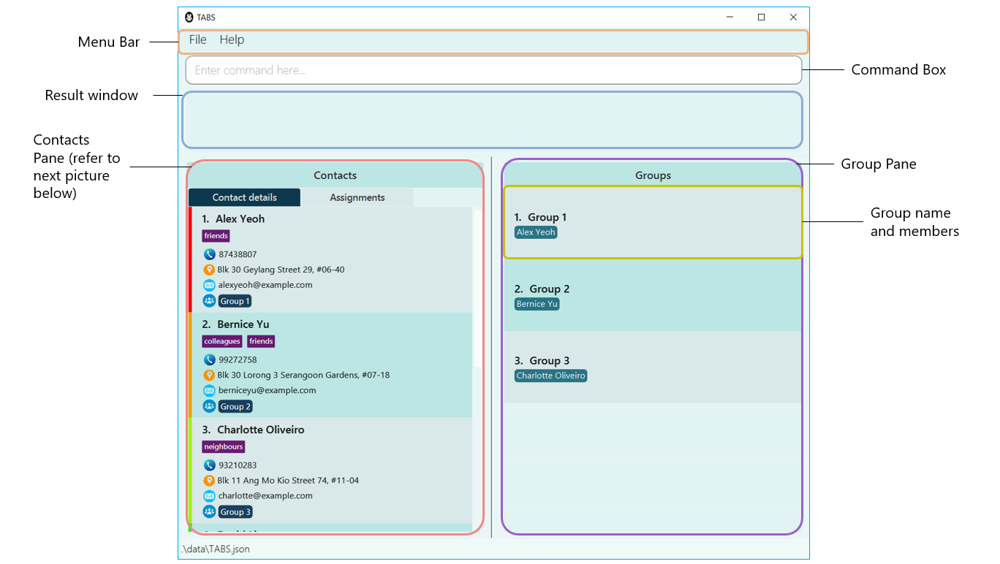
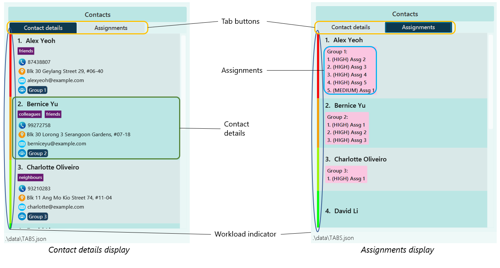
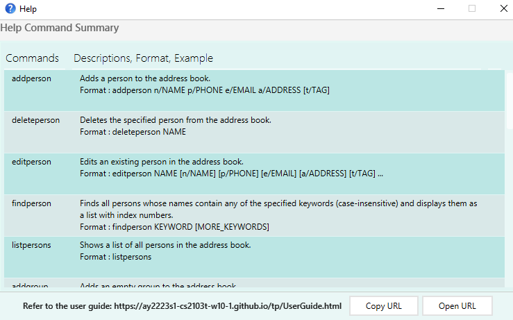
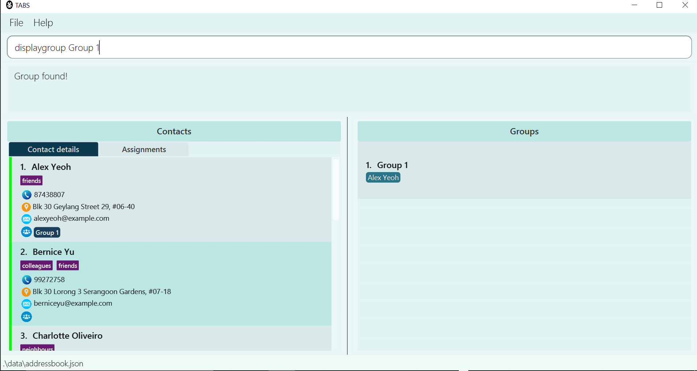
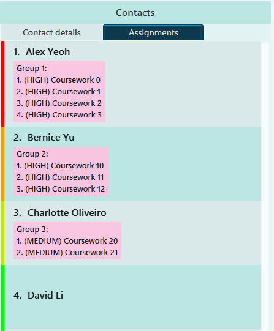

# 1. Overview 

TABS is a desktop application which helps student project team leaders **overview tasks assigned to group members**.
TABS helps in 3 key ways:
1. Contact details management 
2. Group management
3. Delegated task management

TABS aims to reduce the amount of time spent on managing team projects for **students** who already have their academics to contend with. TABS is for people who type quickly as it **optimised for use via Command Line Interface** (CLI) while still having the benefits of a Graphical User Interface (GUI). TABS is available for the **Linux, Windows and Mac OS** operating systems.

---

1. [Overview](#1-overview)
2. [About User Guide](#user-guide)
   - [2.1 Command format](#user-guide2.1)
   - [2.2 Prefixes](#user-guide2.2)
3. [Quick start](#quick-start)
4. [GUI interface](#gui-interface)
5. [Features](#features)
   - [Viewing help: `help`](#viewing-help-help)
   - [Adding a person: `addperson`](#adding-a-person-addperson)
   - [Deleting a person : `deleteperson`](#deleting-a-person-deleteperson)
   - [Editing a person: `editperson`](#editing-a-person-editperson)
   - [Locating persons by name: `findperson`](#locating-persons-by-name-findperson)
   - [Listing all persons: `listpersons`](#listing-all-persons-listpersons)
   - [Adding a group: `addgroup`](#adding-a-group-addgroup)
   - [Deleting a group: `deletegroup`](#deleting-a-group-deletegroup)
   - [Adding a member to a group: `addmember`](#adding-a-member-to-a-group-addmember)
   - [Deleting a member from a group: `deletemember`](#deleting-a-member-from-a-group-deletemember)
   - [Display a group: `displaygroup`](#display-a-group-displaygroup)
   - [Listing all groups: `listgroups`](#listing-all-groups-listgroups)
   - [Assigning a task to a member: `assigntask`](#assigning-a-task-to-a-member-assigntask)
   - [Deleting a task from a member: `deletetask`](#deleting-a-task-from-a-member-deletetask)
   - [Assigning a task to all members: `assigntaskall`](#assigning-a-task-to-all-members-assigntaskall)
   - [Deleting a task from all members: `deletetaskall`](#deleting-a-task-from-all-members-deletetaskall)
   - [Clearing existing data: `clear`](#clearing-all-entries-clear)
  - [Exiting the program : `exit`](#exiting-the-program-exit)
- [Command summary](#command-summary)

---
# 2. About User Guide 

## 2.1 Command format 

**:information_source: Shortcut keys to use the application:** 

* Use the `TAB` key to navigate between command box, person pane, and group pane in TABS.

* Use arrow keys to switch between *Contact details* and *Assignments*.

**:information_source: Notes about the command format:** 

* Words in `UPPER_CASE` are the parameters to be supplied by the user. 
  e.g. in `addperson n/NAME`, `NAME` is a parameter which can be used as `addperson n/John Doe`.

* Items in square brackets are optional. 
  e.g `n/NAME [t/TAG]` can be used as `n/John Doe t/friend` or as `n/John Doe`.

* Items with `…`​ after them can be used multiple times including zero times. 
  e.g. `[t/TAG]…​` can be used as ` ` (i.e. 0 times), `t/friend`, `t/friend t/family` etc.

* Parameters can be in any order. 
  e.g. if the command specifies `n/NAME p/PHONE_NUMBER`, `p/PHONE_NUMBER n/NAME` is also acceptable.

* If a parameter is expected only once in the command but you specified it multiple times, only the last occurrence of the parameter will be taken. 
  e.g. if you specify `p/12341234 p/56785678`, only `p/56785678` will be taken.

* Extraneous parameters for commands that do not take in parameters (such as `listpersons`, `exit` and `clear`) will be ignored. 
  e.g. if the command specifies `listpersons 123`, it will be interpreted as `listpersons`.

* Commands involving the parameter `NAME` is case-sensitive, the `NAME` specified must be
  exactly the same as the one stored in TABS.

## 2.2 Prefixes 
Prefix | Field
--------|------------------
n/ | NAME
p/ | PHONE
e/ | EMAIL
a/ | ADDRESS
t/ | TAG
g/ | GROUP
task/ | TASK
w/ | WORKLOAD
d/ | DEADLINE

---
# 3. Quick start

1. Ensure you have Java 11 or above installed in your Computer.
2. Download the latest TABS.jar.
3. Copy the file to the folder you want to use as the home folder for your TABS.
4. Double-click the file to start the app. The GUI similar to the one below should appear in a few seconds.
Note how the app contains some sample data.
  

  
5. Refer to the [Features](#features) below for details of each command.

---
# 4. GUI interface
The images below show the sections of the TABS user interface.

Overview of the sections in the main window:

Section | Role
--------|------------------
Menu Bar | Display menu items File and Help
Command Box | To type the commands
Result Window | Displays the result of user input
Contacts Pane | Contains the list of persons in TABS
Group Pane | Contains the list of groups in TABS

Overview of the sections in the contacts pane:

Section | Role
--------|------------------
Tab Buttons | Switch between Contact details and Assignments
Assignments | Contains the assignment allocated to the person sorted by group
Contact details | Contains the person's information
Workload indicator | Calculated workload of the person's assignments based on priority

---
## 5. Features

### Viewing help: help

Shows a list of commands explaining how to use TABS and a message to TABS' user guide.

Format: help

### Adding a person: `addperson`

Adds a person to TABS.

Format: `addperson n/NAME p/PHONE_NUMBER e/EMAIL a/ADDRESS [t/TAG]…​`

:bulb:
<b>Tip:</b> A person can have any number of tags (including 0)

 :information_source: **Extra note**:

A person's email can be in the form of `local-part@domain`, where the `domain`
specified must be at least 2 characters long.

Examples:
* `addperson n/John Doe p/98765432 e/johnd@example.com a/John street, block 123, #01-01`
* `addperson n/Betsy Crowe t/friend e/betsycrowe@example a/Newgate Prison p/1234567 t/criminal`

### Deleting a person: `deleteperson`

Deletes the specified person from TABS.

Format: `deleteperson NAME`
* Deletes the person with the specified `NAME`. The person with this `NAME` must already exist in the app.

Examples:
* `deleteperson Betsy` deletes the person with the username `Betsy`.
* `deleteperson Betsy Hoover` deletes the person with the username `Betsy Hoover`.

### Editing a person: `editperson`

Edits an existing person in TABS.

Format: `editperson NAME [n/NAME] [p/PHONE] [e/EMAIL] [a/ADDRESS] [t/TAG]…​`
* Edits the person with the specified `NAME`. The person with this `NAME` must already exist in the app.
* At least one of the optional fields must be provided.
* Existing values will be updated to the input values.
* When editing tags, the existing tags of the person will be removed i.e adding of tags is not cumulative.
* You can remove all the person’s tags by typing `t/` without
    specifying any tags after it.

Examples:
*  `editperson John Doe p/91234567 e/johndoe@example.com` Edits the phone number and email address of `John Doe` to be `91234567` and `johndoe@example.com` respectively.
*  `editperson BetsyCrower n/Betsy Crower t/` Edits the name of `BetsyCrower` to be `Betsy Crower` and clears all existing tags.

### Locating persons by name: `findperson`

Finds persons whose names contain any of the given keywords.

Format: `findperson KEYWORD [MORE_KEYWORDS]`
* The search is case-insensitive. e.g `hans` will match `Hans`
* The order of the keywords does not matter. e.g. `Hans Bo` will match `Bo Hans`
* Only the name is searched.
* Only full words will be matched e.g. `Han` will not match `Hans`
* Persons matching at least one keyword will be returned (i.e. `OR` search).
  e.g. `Hans Bo` will return `Hans Gruber`, `Bo Yang`

Examples:
* `findperson John` returns `john` and `John Doe`
* `findperson alex david` returns `Alex Yeoh`, `David Li`
 
 
  

### Listing all persons: `listpersons`

Shows a list of all persons in TABS.

Format: `listpersons`

### Adding a group: `addgroup`

Adds an empty group with the specified `GROUP` to TABS.

Format: `addgroup g/GROUP`

Examples:
* `addgroup g/CS2103T` will create an empty group with the group name `CS2103T`.

### Deleting a group: `deletegroup`

Deletes the specified group with the group name `GROUP` from TABS.

Format: `deletegroup g/GROUP`

Examples:
* `deletegroup g/CS2103T` deletes the group `CS2103T` from TABS.

### Adding a member to a group: `addmember`

Adds a member to a specified group.

Format: `addmember g/GROUP n/NAME`

Examples:
* `addmember g/CS2103T n/John Doe` will add `John Doe` to the group `CS2103T`.
* `addmember g/CS2101 n/Alice` will add `Alice` to the group `CS2101`.

### Deleting a member from a group: `deletemember`

Deletes an existing person from an existing group in TABS.

Format: `deletemember g/GROUP n/NAME`

Examples:
* `deletemember g/CS2103T n/John Doe` will delete member `John Doe` from the group `CS2103T`.
* `deletemember g/CS2101 n/Alice` will delete member `Alice` from the group `CS2103T`.

### Display a group: `displaygroup`

Displays the group members allocated to the specified `GROUP`.

Format: `displaygroup GROUP`
* Displays the members associated with the `GROUP`.

Examples:
* `displaygroup CS2103T` displays the members associated with `CS2103T`.

### Listing all groups: `listgroups`

Lists all existing groups in TABS.

Format: `listgroups`

### Assigning a task to a member: `assigntask`

Assigns a task to a member with the given name in a group in TABS.

Format: `assigntask NAME g/GROUP task/TASK w/WORKLOAD [d/DEADLINE]`
* Assigns a `TASK` to a person with the specified `NAME`, `GROUP`, `WORKLOAD` and `DEADLINE`.
* `WORKLOAD` specified must be `low`, `medium` or `high` and is case-insensitive.
* `DEADLINE` must be in `yyyy-MM-dd` or `yyyy-MM-dd HH:mm` format.

Examples:
* `assigntask John g/CS2103T task/TeamProject w/High`
assigns `John` in group `CS2103T` with a `High` workload task `TeamProject`.
* `assigntask Alice g/Group Alpha task/Coursework 0 w/Low d/2022-01-01 23:59`
assigns `Alice` in group `Group Alpha` with a `Low` workload task `Coursework 0` and the deadline of the task is `2022-01-01 23:59`.

  :information_source: **Extra note**:

A workload indicator is shown beside each person in TABS.
When the workload of the person increases, the workload indicator will gradually change from green to red.

### Deleting a task from a member: `deletetask`

Deletes a task from a member with the given name in a group.

Format: `deletetask NAME g/GROUP task/TASK`
* Deletes a `TASK` from a person with the specified `NAME` and specified `GROUP`.

Examples:
* `deletetask John g/CS2103T task/TeamProject` deletes task `TeamProject` from person `John` in group `CS2103T`.
* `deletetask Billy g/Team Delta task/Delta Project` deletes `Delta Project` from person `Billy` within group `Team Delta`.

### Assigning a task to all members: `assigntaskall`

Assigns a task to all members in a group. Members with the same task are ignored.

Format: `assigntaskall g/GROUP task/TASK w/WORKLOAD [d/DEADLINE]`
* Assigns a `TASK` to all members with the specified `GROUP`, `WORKLOAD` and `DEADLINE`.
* `WORKLOAD` specified must be `low`, `medium` or `high` and is case-insensitive.
* `DEADLINE` must be in `yyyy-MM-dd` or `yyyy-MM-dd HH:mm` format.

Examples:
* `assigntaskall g/CS2103T task/TeamProject w/High`
assigns all members in group `CS2103T` with a `High` workload task `TeamProject`.
* `assigntaskall g/Group Alpha task/Coursework 0 w/Low d/2022-01-01 23:59`
assigns all members in group `Group Alpha` with a `Low` workload task `Coursework 0` and the deadline of the task is `2022-01-01 23:59`.

### Deleting a task from all members: `deletetaskall`

Deletes a task from all members in a group. Members without this task are ignored.

Format: `deletetaskall g/GROUP task/TASK`
* Deletes a `TASK` from all members with the specified `GROUP`.

Examples:
* `deletetaskall g/CS2103T task/TeamProject` deletes task `TeamProject` from all members in group `CS2103T`.
* `deletetaskall g/Team Delta task/Delta Project` deletes task `Delta Project` from all members with in `Team Delta`.

### Clearing all entries: `clear`

Clears all entries from TABS.

Format: clear

### Exiting the program: `exit`

Exits the program.

Format: `exit`

--------------------------------------------------------------------------------------------------------------------

## Command summary

| Action                    | Format, Examples                                                                                                                                            |
|---------------------------|-------------------------------------------------------------------------------------------------------------------------------------------------------------|
| **Help**                  | `help`                                                                                                                                                      |
| **Add Person**            | `addperson n/NAME p/PHONE_NUMBER e/EMAIL a/ADDRESS [t/TAG]`  e.g. `addperson n/Betsy Crowe t/friend e/betsycrowe@example.com a/Newgate Prison p/1234567` |
| **Delete Person**         | `deleteperson NAME`  e.g. `deleteperson Betsy`                                                                                                           |
| **Edit Person**           | `editperson NAME [n/NAME] [p/PHONE_NUMBER] [e/EMAIL] [a/ADDRESS] [t/TAG]`  e.g. `edituser 2 n/James Lee e/jameslee@example.com`                          |
| **Find Person**           | `findperson KEYWORD [MORE_KEYWORDS]`  e.g. `findperson James Jake`                                                                                       |
| **List Persons**          | `listpersons`                                                                                                                                               |
| **Add Group**             | `addgroup g/GROUP`   e.g. `addgroup g/CS2103T`                                                                                                           |
| **Delete Group**          | `deletegroup g/GROUP`   e.g. `deletegroup g/CS2103T`                                                                                                    |
| **Add Member**            | `addmember g/GROUP n/NAME`   e.g. `addmember g/CS2101 n/Alice`                                                                                          |
| **Delete Member**         | `deletemember g/GROUP n/NAME`   e.g. `deletemember g/CS2101 n/Alice`                                                                                    |
| **Display Group**         | `displaygroup GROUP`   e.g. `displaygroup CS2103T`                                                                                                      |
| **List Groups**           | `listgroups`                                                                                                                                                |
| **Assign Task**           | `assigntask NAME g/GROUP task/TASK w/WORKLOAD [d/DEADLINE]`   e.g. `assigntask Alice g/Group Alpha task/Coursework 0 w/Low  d/2022-01-01 23:59`         |
| **Delete Task**           | `deletetask NAME g/GROUP task/TASK`   e.g. `deletetask John g/CS2103T task/TeamProject`                                                                 |
| **Assign Task   All** | `assigntaskall g/GROUP task/TASK w/WORKLOAD [d/DEADLINE]`   e.g. `assigntaskall g/Group Alpha task/Coursework 0 w/Low  d/2022-01-01 23:59`              |
| **Delete Task   All** | `deletetaskall g/GROUP task/TASK`   e.g. `deletetaskall John g/CS2103T task/TeamProject`                                                                |
| **Clear**                 | `clear`                                                                                                                                                     |
| **Exit**                  | `exit`                                                                                                                                                      |
